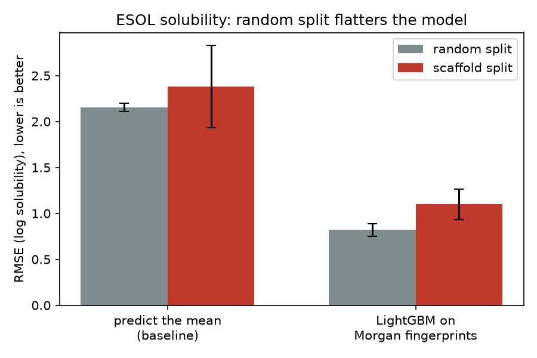

# Does a molecular property model actually generalize? Random vs. scaffold splits on ESOL

A small, honest benchmark. It trains a gradient-boosted model to predict aqueous
solubility from molecular structure, then measures the gap between how well the
model *appears* to work (random train/test split) and how well it works on
chemistry it has never seen (scaffold split).

## Why this matters

Public molecule datasets are built from chemical *series*: clusters of molecules
sharing a common ring core (a Bemis-Murcko scaffold) with different side chains.
A random split scatters near-identical cousins across train and test, so the
model is tested on molecules that closely resemble ones it studied. The score
looks good; it partly measures memorization.

A scaffold split holds out entire scaffold groups, so test molecules share no
core structure with training molecules. That is the situation a chemist faces
when proposing a new series, and it is the honest number.

## Results

ESOL (Delaney) dataset, 1,128 molecules, measured log solubility. Features are
Morgan count fingerprints (radius 2, 2048 bits). Model is LightGBM. Each cell is
the mean and std over 3 seeds. RMSE in log-solubility units; lower is better.

| model | random split | scaffold split |
|---|---|---|
| predict the mean (baseline) | 2.154 ± 0.044 | 2.379 ± 0.449 |
| LightGBM on fingerprints | **0.820 ± 0.068** | **1.100 ± 0.165** |

Fraction of test molecules whose scaffold also appears in the training set:
**83.4% under the random split vs. 0.0% under the scaffold split.**
That overlap is what a random split quietly rewards.



## What I take from it

The model's error rises 34% when it is tested on unfamiliar scaffolds (RMSE 0.820 to 1.100).
Under the random split, 83.4% of test molecules shared a scaffold with something in the training
set. That is the leak: the random-split score is partly a measure of how well the model recognizes
molecules it has already seen relatives of.

The model still learns real structure-property relationships. It beats the predict-the-mean
baseline by 62% under the random split and by 54% under the scaffold split, so it is not just
memorizing. But the number I would quote to a chemist about to synthesize a new series is 1.10,
not 0.82.

Two honest caveats. First, the scaffold-split numbers have much larger seed-to-seed spread
(std 0.165 vs 0.068), because which scaffold families land in the test set matters a lot. Three
seeds is enough to see the effect, not enough to pin its size; I would run ten before quoting a
precise gap. Second, the baseline also gets harder under the scaffold split (2.154 to 2.379),
which means held-out scaffolds differ in their solubility distribution, not only in structure.
Some of the model's extra error is that shift, not only failed generalization.

## Run it

```bash
pip install -r requirements.txt
python benchmark.py        # downloads ESOL, trains, prints the table, writes results/results.csv
python plot_results.py     # writes results/rmse_by_split.png
```

Runs in about a minute on a laptop CPU. No GPU, no API keys.

## Method notes

- **Featurization.** RDKit Morgan count fingerprints, radius 2 (ECFP4-equivalent), 2048 bits.
- **Scaffold split.** Molecules grouped by Bemis-Murcko scaffold; groups shuffled by seed and
  filled into the test set whole until it reaches 20% of the data. No scaffold appears in both sets.
- **Baseline.** Predicting the training-set mean for every molecule. A model that cannot beat
  this has learned nothing.
- **Seeds.** 3 seeds per configuration. If seed-to-seed std exceeds the difference between two
  cells, that difference is not real.

## Limitations

- One dataset and one model family. The size of the gap will differ on other properties.
- Random-scaffold split (shuffled groups) rather than the deterministic largest-scaffolds-to-train
  variant; the two can give different numbers.
- No hyperparameter tuning, deliberately. Heavy tuning on a 1,128-molecule dataset is how you
  fool yourself.

## Data

ESOL / Delaney solubility dataset via the MoleculeNet distribution. Scaffold-split methodology
follows Bemis & Murcko (1996) and the evaluation practice argued for in MoleculeNet (Wu et al., 2018).
